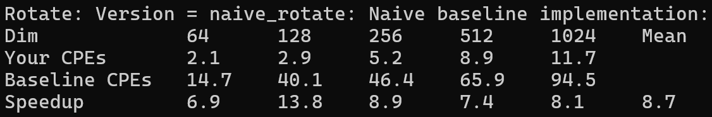
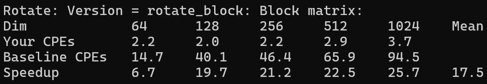
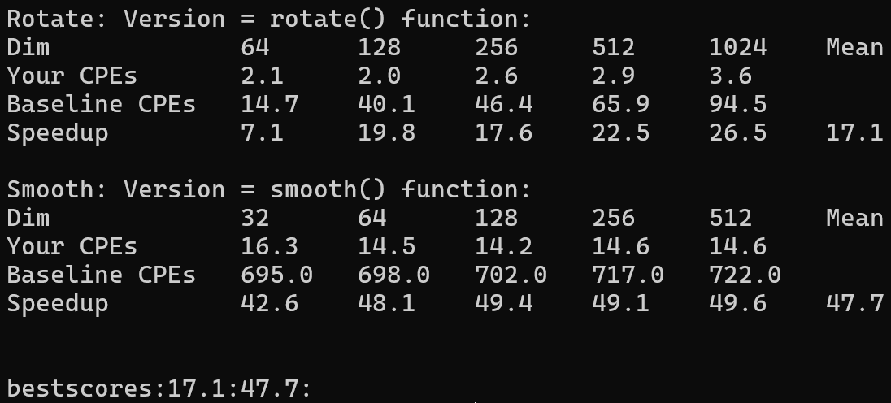

# <center>Report to Performance Lab</center>

## What can we learn from Perflab

通过完成performance lab，我们可以对cpu的流水线结构、乱序处理技术以及存储器层次结构等计算机底层结构有更全面的认识，对程序的时间和空间局部性有更深刻的理解，对程序优化技术比如循环展开、矩阵分块等有更熟悉的掌握。这都是我们成长为一个优秀的程序员乃至计算机科学家的必经之路。

## How should Perflab be conducted

只有kernels.c文件才能被我们改动。通过添加不同版本的函数，验证我们每一步优化的效果。

### ROTATE

#### 原始版本(Naive baseline implementation)

```c
void naive_rotate(int dim, pixel *src, pixel *dst) 
{
    int i, j;

    for (i = 0; i < dim; i++)
	for (j = 0; j < dim; j++)
	    dst[RIDX(dim-1-j, i, dim)] = src[RIDX(i, j, dim)];
}
```

这个原始版本的旋转就是算法思路的简单实现，也就是先将矩阵转置，再颠倒行。

我们首先从cpu指令级角度分析这个程序的性能。我们可以看到在循环体内只有这一条语句`dst[RIDX(dim-1-j, i, dim)] = src[RIDX(i, j, dim)];`，在底层实现上它分为三步操作：第一步先计算出数组的索引，第二步再从内存中读数据，第三步再向内存中写数据。由于读和写的目标不同，所以没有形成写/读相关，于是读和写可以并行地来进行。

我们再来从存储的角度分析程序性能。我们可以看到在内层循环中，src矩阵是按行取出的，符合矩阵的存储方式，因此缓存的命中率很高；而dst矩阵是按列写入的，这样会导致几乎每次向缓存中引用都不命中。这是程序性能的主要瓶颈。



我们可以看到即使是原始版本也有不小的speedup。这是因为我们编译时开启了O2优化，编译器会自动帮我们做一些优化来提升程序性能。

#### 消除循环的低效率(Eliminate the inefficiency of loops)

我们看到在内层循环中j每变一次，就要重复计算一次dim-1-j。简单地交换内外循环的次序便可以解决这个问题。

```c
void rotate1(int dim, pixel *src, pixel *dst) 
{
    int i, j, index;

    for (j = 0; j < dim; j++)
    {
        index = dim-1-j;
        for (i = 0; i < dim; i++)
            dst[RIDX(index, i, dim)] = src[RIDX(i, j, dim)];
    }
}
```

交换内外循环的次序也导致了另一个结果，那就是dst矩阵变成了按行写入，而src矩阵变成了按列读取，从原来的写不命中占主导变成了读不命中占主导。


有人说RIDX的调用会产生开销。其实不是的。RIDX是程序定义的宏，编译时会被替换掉，不会产生函数调用的开销。

#### 改变寻址方式

我们也可以采用指针的方式来寻址，这样可以避免索引的多次计算。

```c
void rotate2(int dim, pixel *src, pixel *dst) 
{
    int i, j;
    pixel* index_d = NULL, *index_s = NULL;

    for (j = 0; j < dim; j++)
    {
        index_d = &dst[RIDX(dim-1-j, 0, dim)];
        index_s = &src[RIDX(0, j, dim)];
        for (i = 0; i < dim; i++)
        {
            *index_d++ = *index_s;
            index_s += dim;
        }
    }
}
```

但是从结果上看，我们这步优化并没有起到效果。


#### 循环展开(loop unrolling)

我们用循环展开的手段来优化程序。

```c
void rotate3(int dim, pixel *src, pixel *dst) 
{
    int i, j, border = dim - 3, update2 = dim*2, update3 = update2 + dim, update4 = update2 + update2;
    pixel *index_d1 = NULL, *index_s1 = NULL, 
          *index_d2 = NULL, *index_s2 = NULL, 
          *index_d3 = NULL, *index_s3 = NULL, 
          *index_d4 = NULL, *index_s4 = NULL;

    for (j = 0; j < dim; j++)
    {
        index_d1 = &dst[RIDX(dim-1-j, 0, dim)];
        index_s1 = &src[RIDX(0, j, dim)];
        index_d2 = index_d1 + 1;
        index_d3 = index_d1 + 2;
        index_d4 = index_d1 + 3;
        index_s2 = index_s1 + dim;
        index_s3 = index_s1 + update2;
        index_s4 = index_s1 + update3;
        for (i = 0; i < border; i += 4)
        {
            *index_d1 = *index_s1;
            *index_d2 = *index_s2;
            *index_d3 = *index_s3;
            *index_d4 = *index_s4;
                 
            index_d1 += 4;
            index_d2 += 4;
            index_d3 += 4;
            index_d4 += 4;
            index_s1 += update4;
            index_s2 += update4;
            index_s3 += update4;
            index_s4 += update4;
        }

        for (; i < dim; i++)
            dst[RIDX(dim-1-j, i, dim)] = src[RIDX(i, j, dim)];
    }
}
```

但是出乎意料的是，程序的性能却并没有因此而得到提升，反而是跟之前持平甚至有些下降。


#### 矩阵分块(Block matrix)

```c
void rotate_block(int dim, pixel *src, pixel *dst) 
{
    int sub_dim = 16;
    int r, c, i, j, i_border, j_border, border = dim - sub_dim + 1, index;

    for (r = 0; r < border; r += sub_dim)
    {
        i_border = r + sub_dim;
        for (c = 0; c < border; c += sub_dim)
        {
            j_border = c + sub_dim;
            for (j = c; j < j_border; j++)
            {
                index = dim-1-j;
                for (i = r; i < i_border; i++)
                    dst[RIDX(index, i, dim)] = src[RIDX(i, j, dim)];
            }
        }

        j_border = dim;
        for (j = c; j < j_border; j++)
        {
            index = dim-1-j;
            for (i = r; i < i_border; i++)
                dst[RIDX(index, i, dim)] = src[RIDX(i, j, dim)];
        }
    }

    i_border = dim;
    for (c = 0; c < border; c += sub_dim)
    {
        j_border = c + sub_dim;
        for (j = c; j < j_border; j++)
        {
            index = dim-1-j;
            for (i = r; i < i_border; i++)
                dst[RIDX(index, i, dim)] = src[RIDX(i, j, dim)];
        }
    }

    j_border = dim;
    for (j = c; j < j_border; j++)
    {
        index = dim-1-j;
        for (i = r; i < i_border; i++)
            dst[RIDX(index, i, dim)] = src[RIDX(i, j, dim)];
    }
}
```

矩阵分块明显提升了程序的性能。它的原理是：当矩阵过大时，缓存不足以放得下整个矩阵。由于src是按列读取的，所以会发生冲突不命中。然而，当矩阵分块之后，每一块矩阵都很小，以至于缓存可以放得下整个矩阵，那么当读取src时，就只会出现第一次的冷不命中，剩下的访问都会命中。



那么为什么经过矩阵分块之后，我们的程序的CPE还会随着矩阵维数的增大而略有提升呢？这是因为在程序运行时，矩阵会从硬盘加载到各级缓存中。L1 Cache存放着分块后的小矩阵，L2 Cache存放着整个大矩阵。当矩阵过大以至于L2 Cache都放不下时，就会出现L2 Cache不命中，于是再从L3 Cache中替换行。

#### Summary

在对rotate程序的优化过程中，我们使用了消除循环的低效率、改变寻址方式、循环展开和矩阵分块等多种优化手段，有的效果明显，有的则不是。关键问题是能否对限制程序性能的主要瓶颈做出优化。限制rotate程序性能的主要瓶颈就是对内存的访问。矩阵分块可以大大改善这一点，所以效果很好；而改变寻址方式和循环展开只是对计算量做了一点小优化，对内存访问效率并没有提升，所以效果不好。

所以让我们重新审视rotate1。它相对于原始版本有很明显的性能提升，难道真的是因为dim-1-j的计算次数少了吗？我觉得不是。只是这一点优化绝不会造成这么大的性能提升。问题在于从写不命中变成读不命中上。向内存中写是比向内存中读更复杂的操作，它需要向所有包含这一数据的缓存中写数据，它的开销是很大的。将写不命中变成读不命中减少了内存访问的开销，提升了程序的性能。

### SMOOTH

#### 原始版本(Naive baseline implementation)

```c
void naive_smooth(int dim, pixel *src, pixel *dst) 
{
    int i, j;

    for (i = 0; i < dim; i++)
	for (j = 0; j < dim; j++)
	    dst[RIDX(i, j, dim)] = avg(dim, i, j, src);
}
```

这个原始版本的平滑就是算法思路的简单实现，也就是求每个点周围像素的均值。

我们的dst矩阵时按行写入的，src矩阵也基本是按行读取的，所以内存访问上的优化空间不大。


#### 减少函数调用开销(Reduce expenses of function calls)

我们可以看到这部分代码定义了很多函数。虽然增强了代码的可读性和可维护性，但是层层函数调用会增加开销。所以我们把函数的定义改为宏或者内联函数。宏和内联函数在编译时，编译器会尝试将函数调用处函数体的代码直接替换，这样就避免了函数调用的开销，从而提高程序的执行速度。

#### 消除循环的低效率(Eliminate the inefficiency of loops)

我们可以看到在循环内部多次调用max和min来计算累加的范围，这是低效率的。我们可以把这部分计算移到循环外来进行。

```c
static inline pixel AVG(int dim, int i, int j, pixel *src) 
{
    int ii, jj;
    int i_low = max(i-1, 0), i_high = min(i+1, dim-1), j_low = max(j-1, 0), j_high = min(j+1, dim-1);
    pixel_sum sum;
    pixel current_pixel;

    initialize_pixel_sum(&sum);
    for(ii = i_low; ii <= i_high; ii++) 
	for(jj = j_low; jj <= j_high; jj++) 
	    accumulate_sum(&sum, src[RIDX(ii, jj, dim)]);

    assign_sum_to_pixel(&current_pixel, sum);
    return current_pixel;
}
```

令人困惑的是程序的性能反而下降了。


#### 算法优化(Better algorithm)

我们看看我们的算法有没有优化的空间。我们每次计算一个像素的值时，都要把它周围八个像素和它自己累加起来，相当于每次都要做8次加法，那么总共就是$dim \times dim \times 8$次加法！可以看出我们计算加法的次数是非常多的，我们可以试着从算法的角度去优化，以减少加法的次数。（为了便于理解，这里将r,g,b三个值的计算统称为一次）

我们仔细观察运算过程。当计算(i, j)像素时，将(i-1, j-1), (i-1, j), (i-1, j+1), (i, j-1), (i, j), (i, j+1), (i+1, j-1), (i+1, j), (i+1, j+1)九个像素加了起来。下一步当计算(i, j+1)像素时，将(i-1, j), (i-1, j+1), (i-1, j+2), (i, j), (i, j+1), (i, j+2), (i+1, j), (i+1, j+1), (i+1, j+2)九个像素加了起来。我们可以看到这个过程中有6个像素重复加了2次。如果能消除这一重复计算，我们程序的性能将得到提升。

我们算法的初步思路是这样的：每次在计算第i行的像素之前，先建立一个sum数组，这个数组中的第j个元素计算了(i-1, j), (i, j), (i+1, j)三个像素的和，也就是保存了纵向的累加值。之后当计算(i, j)像素时，只需要将sum[j-1], sum[j], sum[j+1]三个值加起来即可。当外层循环更新时，sum数组也需要更新。当在上下左右四个边界和四个角时，像素的个数会有不同，需要特殊处理。

我们计算一下我们的程序需要多少次加法。当计算某一行的像素时，需要先更新sum数组，每个元素需要2次加法，所以就是$dim \times 2$次加法。随后计算像素值时，每个像素也需要2次加法，所以也是$dim \times 2$次加法。于是总共就是$dim \times dim \times 4$次加法！相比于之前少了一半！


这个策略有种以空间换时间的感觉，多用了sum数组的存储空间，换得了程序执行效率的提升。

在代码书写的细节上，我们使用switch语句代替了if-else，以期避免流水线预测分支错误带来的不必要的开销。但这里我们也只能是给编译器的一点建议，至于编译器到底怎么生成汇编代码，那得看编译器的选择。

```c
void smooth_dp(int dim, pixel *src, pixel *dst) 
{
    pixel_sum *sum = (pixel_sum*)calloc(dim, sizeof(pixel_sum));
    int i, j;

    for(i = 0; i < dim; ++i)
    {
        // initailize and update the sum array
        switch(i)
        {
            case 0:
                for(j = 0; j < dim; ++j)
                {
                    sum[j].red = src[RIDX(0, j, dim)].red + src[RIDX(1, j, dim)].red;
                    sum[j].green = src[RIDX(0, j, dim)].green + src[RIDX(1, j, dim)].green;
                    sum[j].blue = src[RIDX(0, j, dim)].blue + src[RIDX(1, j, dim)].blue;        
                }
                break;
            default:
                if(i == dim - 1)
                {
                    for(j = 0; j < dim; ++j)
                    {
                        sum[j].red = src[RIDX(dim-1, j, dim)].red + src[RIDX(dim-2, j, dim)].red;
                        sum[j].green = src[RIDX(dim-1, j, dim)].green + src[RIDX(dim-2, j, dim)].green;
                        sum[j].blue = src[RIDX(dim-1, j, dim)].blue + src[RIDX(dim-2, j, dim)].blue;
                    }
                }
                else
                {
                    for(j = 0; j < dim; ++j)
                    {
                        sum[j].red = src[RIDX(i-1, j, dim)].red + src[RIDX(i, j, dim)].red + src[RIDX(i+1, j, dim)].red;
                        sum[j].green = src[RIDX(i-1, j, dim)].green + src[RIDX(i, j, dim)].green + src[RIDX(i+1, j, dim)].green;
                        sum[j].blue = src[RIDX(i-1, j, dim)].blue + src[RIDX(i, j, dim)].blue + src[RIDX(i+1, j, dim)].blue;
                    }
                }        
        }

        // accumulate the sum array
        for(j = 0; j < dim; ++j)
        {
            if(i == 0 || i == dim - 1)
            {
                if(j == 0)
                {
                    dst[RIDX(i, 0, dim)].red = (sum[0].red + sum[1].red)/4;
                    dst[RIDX(i, 0, dim)].green = (sum[0].green + sum[1].green)/4;
                    dst[RIDX(i, 0, dim)].blue = (sum[0].blue + sum[1].blue)/4;
                }
                else if(j == dim - 1)
                {
                    dst[RIDX(i, dim-1, dim)].red = (sum[dim-1].red + sum[dim-2].red)/4;
                    dst[RIDX(i, dim-1, dim)].green = (sum[dim-1].green + sum[dim-2].green)/4;
                    dst[RIDX(i, dim-1, dim)].blue = (sum[dim-1].blue + sum[dim-2].blue)/4;
                }
                else
                {
                    dst[RIDX(i, j, dim)].red = (sum[j].red + sum[j-1].red + sum[j+1].red)/6;
                    dst[RIDX(i, j, dim)].green = (sum[j].green + sum[j-1].green + sum[j+1].green)/6;
                    dst[RIDX(i, j, dim)].blue = (sum[j].blue + sum[j-1].blue + sum[j+1].blue)/6;
                }
            }
            else
            {
                if(j == 0)
                {
                    dst[RIDX(i, 0, dim)].red = (sum[0].red + sum[1].red)/6;
                    dst[RIDX(i, 0, dim)].green = (sum[0].green + sum[1].green)/6;
                    dst[RIDX(i, 0, dim)].blue = (sum[0].blue + sum[1].blue)/6;
                }
                else if(j == dim - 1)
                {
                    dst[RIDX(i, dim-1, dim)].red = (sum[dim-1].red + sum[dim-2].red)/6;
                    dst[RIDX(i, dim-1, dim)].green = (sum[dim-1].green + sum[dim-2].green)/6;
                    dst[RIDX(i, dim-1, dim)].blue = (sum[dim-1].blue + sum[dim-2].blue)/6;
                }
                else
                {
                    dst[RIDX(i, j, dim)].red = (sum[j].red + sum[j-1].red + sum[j+1].red)/9;
                    dst[RIDX(i, j, dim)].green = (sum[j].green + sum[j-1].green + sum[j+1].green)/9;
                    dst[RIDX(i, j, dim)].blue = (sum[j].blue + sum[j-1].blue + sum[j+1].blue)/9;
                }
            }  
        }
    }
}
```

在下一版中，我为了改善代码的结构和减少判断语句的使用，做了一点小改动，却得到了程序性能的断崖式下跌。在计算像素的最终值时要将累加值除以像素的总个数。我一开始觉得第一版除以4，6和9的部分的判断语句写的有些复杂，于是重新写了一版。在这版中，使用col_size和total_size记录像素的个数，最后再除以这个变量。但恰恰是这个我以为是让程序结构更好的改动，导致了程序性能的下跌。


我们知道除法在cpu上是一个很慢的操作，一般需要十几个时钟周期。在上一版中，我们在编写代码时明确指出了除数的值是4，6或9，这样的话编译器就可以通过将除法转化为右移或乘法来避免除法，提升程序的性能。但是在这一版中，我们的除数是一个变量，这时编译器就无法优化除法，只能被迫进行很慢的除法，拖垮了程序的性能。

```c
void smooth_dp1(int dim, pixel *src, pixel *dst) 
{
    pixel_sum *sum = (pixel_sum*)calloc(dim, sizeof(pixel_sum));
    int i, j, col_size, total_size;

    for(i = 0; i < dim; ++i)
    {
        // initailize and update the sum array
        switch(i)
        {
            case 0:
                for(j = 0; j < dim; ++j)
                {
                    sum[j].red = src[RIDX(0, j, dim)].red + src[RIDX(1, j, dim)].red;
                    sum[j].green = src[RIDX(0, j, dim)].green + src[RIDX(1, j, dim)].green;
                    sum[j].blue = src[RIDX(0, j, dim)].blue + src[RIDX(1, j, dim)].blue;        
                }
                col_size = 2;
                break;
            default:
                if(i == dim - 1)
                {
                    for(j = 0; j < dim; ++j)
                    {
                        sum[j].red = src[RIDX(dim-1, j, dim)].red + src[RIDX(dim-2, j, dim)].red;
                        sum[j].green = src[RIDX(dim-1, j, dim)].green + src[RIDX(dim-2, j, dim)].green;
                        sum[j].blue = src[RIDX(dim-1, j, dim)].blue + src[RIDX(dim-2, j, dim)].blue;
                    }
                    col_size = 2;
                }
                else
                {
                    for(j = 0; j < dim; ++j)
                    {
                        sum[j].red = src[RIDX(i-1, j, dim)].red + src[RIDX(i, j, dim)].red + src[RIDX(i+1, j, dim)].red;
                        sum[j].green = src[RIDX(i-1, j, dim)].green + src[RIDX(i, j, dim)].green + src[RIDX(i+1, j, dim)].green;
                        sum[j].blue = src[RIDX(i-1, j, dim)].blue + src[RIDX(i, j, dim)].blue + src[RIDX(i+1, j, dim)].blue;
                    }
                    col_size = 3;
                }        
        }

        // accumulate the sum array
        for(j = 0; j < dim; ++j)
        {
            if(j == 0)
            {
                total_size = col_size << 1;
                dst[RIDX(i, 0, dim)].red = (sum[0].red + sum[1].red)/total_size;
                dst[RIDX(i, 0, dim)].green = (sum[0].green + sum[1].green)/total_size;
                dst[RIDX(i, 0, dim)].blue = (sum[0].blue + sum[1].blue)/total_size;
            }
            else if(j == dim - 1)
            {
                total_size = col_size << 1;
                dst[RIDX(i, dim-1, dim)].red = (sum[dim-1].red + sum[dim-2].red)/total_size;
                dst[RIDX(i, dim-1, dim)].green = (sum[dim-1].green + sum[dim-2].green)/total_size;
                dst[RIDX(i, dim-1, dim)].blue = (sum[dim-1].blue + sum[dim-2].blue)/total_size;
            }
            else
            {
                total_size = (col_size << 1) + col_size;
                dst[RIDX(i, j, dim)].red = (sum[j].red + sum[j-1].red + sum[j+1].red)/total_size;
                dst[RIDX(i, j, dim)].green = (sum[j].green + sum[j-1].green + sum[j+1].green)/total_size;
                dst[RIDX(i, j, dim)].blue = (sum[j].blue + sum[j-1].blue + sum[j+1].blue)/total_size;
            } 
        }
    }
}
```

在更新sum数组时可以有一个小优化。当i=1时，原来的方法需要将3个像素加起来。但是i=0时已经计算了前2个像素的和并存放到了sum数组中，这时只需要将原来sum数组的值加上第3个像素即可，加法次数从2次减少到1次。当i=dim-1时也一样，只需要将原来sum数组的值减去第1个像素。

```c
void smooth_dp2(int dim, pixel *src, pixel *dst) 
{
    pixel_sum *sum = (pixel_sum*)calloc(dim, sizeof(pixel_sum));
    int i, j;

    for(i = 0; i < dim; ++i)
    {
        // initailize and update the sum array
        switch(i)
        {
            case 0:
                for(j = 0; j < dim; ++j)
                {
                    sum[j].red = src[RIDX(0, j, dim)].red + src[RIDX(1, j, dim)].red;
                    sum[j].green = src[RIDX(0, j, dim)].green + src[RIDX(1, j, dim)].green;
                    sum[j].blue = src[RIDX(0, j, dim)].blue + src[RIDX(1, j, dim)].blue;        
                }
                break;
            case 1:
                for(j = 0; j < dim; ++j)
                {
                    sum[j].red = sum[j].red + src[RIDX(2, j, dim)].red;
                    sum[j].green = sum[j].green + src[RIDX(2, j, dim)].green;
                    sum[j].blue = sum[j].blue + src[RIDX(2, j, dim)].blue;
                }
                break;
            default:
                if(i == dim - 1)
                {
                    for(j = 0; j < dim; ++j)
                    {
                        sum[j].red = sum[j].red - src[RIDX(dim-3, j, dim)].red;
                        sum[j].green = sum[j].green - src[RIDX(dim-3, j, dim)].green;
                        sum[j].blue = sum[j].blue - src[RIDX(dim-3, j, dim)].blue;
                    }
                }
                else
                {
                    for(j = 0; j < dim; ++j)
                    {
                        sum[j].red = sum[j].red - src[RIDX(i-2, j, dim)].red + src[RIDX(i+1, j, dim)].red;
                        sum[j].green = sum[j].green - src[RIDX(i-2, j, dim)].green + src[RIDX(i+1, j, dim)].green;
                        sum[j].blue = sum[j].blue - src[RIDX(i-2, j, dim)].blue + src[RIDX(i+1, j, dim)].blue;
                    }
                }        
        }

        // accumulate the sum array
        for(j = 0; j < dim; ++j)
        {
            if(i == 0 || i == dim - 1)
            {
                if(j == 0)
                {
                    dst[RIDX(i, 0, dim)].red = (sum[0].red + sum[1].red)/4;
                    dst[RIDX(i, 0, dim)].green = (sum[0].green + sum[1].green)/4;
                    dst[RIDX(i, 0, dim)].blue = (sum[0].blue + sum[1].blue)/4;
                }
                else if(j == dim - 1)
                {
                    dst[RIDX(i, dim-1, dim)].red = (sum[dim-1].red + sum[dim-2].red)/4;
                    dst[RIDX(i, dim-1, dim)].green = (sum[dim-1].green + sum[dim-2].green)/4;
                    dst[RIDX(i, dim-1, dim)].blue = (sum[dim-1].blue + sum[dim-2].blue)/4;
                }
                else
                {
                    dst[RIDX(i, j, dim)].red = (sum[j].red + sum[j-1].red + sum[j+1].red)/6;
                    dst[RIDX(i, j, dim)].green = (sum[j].green + sum[j-1].green + sum[j+1].green)/6;
                    dst[RIDX(i, j, dim)].blue = (sum[j].blue + sum[j-1].blue + sum[j+1].blue)/6;
                }
            }
            else
            {
                if(j == 0)
                {
                    dst[RIDX(i, 0, dim)].red = (sum[0].red + sum[1].red)/6;
                    dst[RIDX(i, 0, dim)].green = (sum[0].green + sum[1].green)/6;
                    dst[RIDX(i, 0, dim)].blue = (sum[0].blue + sum[1].blue)/6;
                }
                else if(j == dim - 1)
                {
                    dst[RIDX(i, dim-1, dim)].red = (sum[dim-1].red + sum[dim-2].red)/6;
                    dst[RIDX(i, dim-1, dim)].green = (sum[dim-1].green + sum[dim-2].green)/6;
                    dst[RIDX(i, dim-1, dim)].blue = (sum[dim-1].blue + sum[dim-2].blue)/6;
                }
                else
                {
                    dst[RIDX(i, j, dim)].red = (sum[j].red + sum[j-1].red + sum[j+1].red)/9;
                    dst[RIDX(i, j, dim)].green = (sum[j].green + sum[j-1].green + sum[j+1].green)/9;
                    dst[RIDX(i, j, dim)].blue = (sum[j].blue + sum[j-1].blue + sum[j+1].blue)/9;
                }
            }  
        }
    }
}
```


那么类似地，累加sum数组时也可以采取这样的思路。当j=1时，将sum[j-1]的值加上第3个像素;当j=dim-1时，将sum[j-1]的值减去第1个像素。

```c
void smooth_dp3(int dim, pixel *src, pixel *dst) 
{
    pixel_sum *sum_col = (pixel_sum*)calloc(dim, sizeof(pixel_sum));
    pixel_sum *sum_row = (pixel_sum*)calloc(dim, sizeof(pixel_sum));
    int i, j, col_size;

    for(i = 0; i < dim; ++i)
    {
        // initailize and update the sum_col array
        switch(i)
        {
            case 0:
                for(j = 0; j < dim; ++j)
                {
                    sum_col[j].red = src[RIDX(0, j, dim)].red + src[RIDX(1, j, dim)].red;
                    sum_col[j].green = src[RIDX(0, j, dim)].green + src[RIDX(1, j, dim)].green;
                    sum_col[j].blue = src[RIDX(0, j, dim)].blue + src[RIDX(1, j, dim)].blue;
                }
                col_size = 2;
                break;
            case 1:
                for(j = 0; j < dim; ++j)
                {
                    sum_col[j].red += src[RIDX(2, j, dim)].red;
                    sum_col[j].green += src[RIDX(2, j, dim)].green;
                    sum_col[j].blue += src[RIDX(2, j, dim)].blue;
                }
                col_size = 3;
                break;
            default:
                if(i == dim - 1)
                {
                    for(j = 0; j < dim; ++j)
                    {
                        sum_col[j].red -= src[RIDX(dim-3, j, dim)].red;
                        sum_col[j].green -= src[RIDX(dim-3, j, dim)].green;
                        sum_col[j].blue -= src[RIDX(dim-3, j, dim)].blue;
                    }
                    col_size = 2;
                }
                else
                {
                    for(j = 0; j < dim; ++j)
                    {
                        sum_col[j].red = sum_col[j].red - src[RIDX(i-2, j, dim)].red + src[RIDX(i+1, j, dim)].red;
                        sum_col[j].green = sum_col[j].green - src[RIDX(i-2, j, dim)].green + src[RIDX(i+1, j, dim)].green;
                        sum_col[j].blue = sum_col[j].blue - src[RIDX(i-2, j, dim)].blue + src[RIDX(i+1, j, dim)].blue;
                    }
                    col_size = 3;
                }        
        }

        // accumulate the sum array
        for(j = 0; j < dim; ++j)
        {
            switch(j)
            {
                case 0:
                    sum_row[0].red = sum_col[0].red + sum_col[1].red;
                    sum_row[0].green = sum_col[0].green + sum_col[1].green;
                    sum_row[0].blue = sum_col[0].blue + sum_col[1].blue;
                    sum_row[0].num = col_size << 1;
                    break;
                case 1:
                    sum_row[1].red = sum_row[0].red + sum_col[2].red;
                    sum_row[1].green = sum_row[0].green + sum_col[2].green;
                    sum_row[1].blue = sum_row[0].blue + sum_col[2].blue;
                    sum_row[1].num = (col_size << 1) + col_size;
                    break;
                default:
                    if(j == dim - 1)
                    {
                        sum_row[dim-1].red = sum_row[dim-2].red - sum_col[dim-3].red;
                        sum_row[dim-1].green = sum_row[dim-2].green - sum_col[dim-3].green;
                        sum_row[dim-1].blue = sum_row[dim-2].blue - sum_col[dim-3].blue;
                        sum_row[dim-1].num = col_size << 1;
                    }
                    else
                    {
                        sum_row[j].red = sum_row[j-1].red + sum_col[j+1].red - sum_col[j-2].red;
                        sum_row[j].green = sum_row[j-1].green + sum_col[j+1].green - sum_col[j-2].green;
                        sum_row[j].blue = sum_row[j-1].blue + sum_col[j+1].blue - sum_col[j-2].blue;
                        sum_row[j].num = sum_row[j-1].num;
                    }
            }
        }

        for(j = 0; j < dim; ++j)
        {
            if(sum_row[j].num == 4)
            { 
                dst[RIDX(i, j, dim)].red = sum_row[j].red/4;
                dst[RIDX(i, j, dim)].green = sum_row[j].green/4;
                dst[RIDX(i, j, dim)].blue = sum_row[j].blue/4;
            }
            else if(sum_row[j].num == 6)
            { 
                dst[RIDX(i, j, dim)].red = sum_row[j].red/6;
                dst[RIDX(i, j, dim)].green = sum_row[j].green/6;
                dst[RIDX(i, j, dim)].blue = sum_row[j].blue/6;
            }
            else
            { 
                dst[RIDX(i, j, dim)].red = sum_row[j].red/9;
                dst[RIDX(i, j, dim)].green = sum_row[j].green/9;
                dst[RIDX(i, j, dim)].blue = sum_row[j].blue/9;
            }
        }
    }
}
```


但是当我们测试时却发现程序的性能反而降低了。我猜测可能的原因是：这种写法破坏了原本的并行性，导致计算sum_row数组时只能先等前一个算完，才能开始下一个，降低了程序的性能。

有人可能会说pixel_sum结构体中num元素有时候就没用，浪费了存储空间，是不是应该去掉它。其实不是的。如果这个结构体中只有red,green和blue这三个int变量，那么整个结构体的大小是12byte。这是不符合8字节的数据对齐原则的，会减慢内存访问效率和降低缓存利用率。如果加上num这个变量，那么结构体的大小便成了16byte，符合数据对齐原则，更有利于程序的运行。

#### 矩阵分块

```c
void smooth_block(int dim, pixel *src, pixel *dst) 
{
    int sub_dim = 16;
    int r, c, i, j, k, i_border, j_border, border = dim - sub_dim + 1, i_low, i_high, j_low, j_high;
    pixel_sum *sum = (pixel_sum*)calloc(dim, sizeof(pixel_sum));

    for (r = 0; r < border; r += sub_dim)
    {
        i_border = r + sub_dim;
        for (c = 0; c < border; c += sub_dim)
        {
            j_border = c + sub_dim;
            for(i = r; i < i_border; ++i)
            {
                // initailize and update the sum array
                i_low = max(i-1, 0);
                i_high = min(i+1, dim-1);
                j_low = max(c-1, 0);
                j_high = min(j_border, dim-1);
                for(j = j_low; j <= j_high; ++j)
                {
                    sum[j].red = sum[j].green = sum[j].blue = 0;
                    for(k = i_low; k <= i_high; ++k)
                    {
                        sum[j].red += src[RIDX(k, j, dim)].red;
                        sum[j].green += src[RIDX(k, j, dim)].green;
                        sum[j].blue += src[RIDX(k, j, dim)].blue;
                    }
                }

                // accumulate the sum array
                for(j = c; j < j_border; ++j)
                {
                    if(i == 0 || i == dim - 1)
                    {
                        if(j == 0)
                        {
                            dst[RIDX(i, 0, dim)].red = (sum[0].red + sum[1].red)/4;
                            dst[RIDX(i, 0, dim)].green = (sum[0].green + sum[1].green)/4;
                            dst[RIDX(i, 0, dim)].blue = (sum[0].blue + sum[1].blue)/4;
                        }
                        else if(j == dim - 1)
                        {
                            dst[RIDX(i, dim-1, dim)].red = (sum[dim-1].red + sum[dim-2].red)/4;
                            dst[RIDX(i, dim-1, dim)].green = (sum[dim-1].green + sum[dim-2].green)/4;
                            dst[RIDX(i, dim-1, dim)].blue = (sum[dim-1].blue + sum[dim-2].blue)/4;
                        }
                        else
                        {
                            dst[RIDX(i, j, dim)].red = (sum[j].red + sum[j-1].red + sum[j+1].red)/6;
                            dst[RIDX(i, j, dim)].green = (sum[j].green + sum[j-1].green + sum[j+1].green)/6;
                            dst[RIDX(i, j, dim)].blue = (sum[j].blue + sum[j-1].blue + sum[j+1].blue)/6;
                        }
                    }
                    else
                    {
                        if(j == 0)
                        {
                            dst[RIDX(i, 0, dim)].red = (sum[0].red + sum[1].red)/6;
                            dst[RIDX(i, 0, dim)].green = (sum[0].green + sum[1].green)/6;
                            dst[RIDX(i, 0, dim)].blue = (sum[0].blue + sum[1].blue)/6;
                        }
                        else if(j == dim - 1)
                        {
                            dst[RIDX(i, dim-1, dim)].red = (sum[dim-1].red + sum[dim-2].red)/6;
                            dst[RIDX(i, dim-1, dim)].green = (sum[dim-1].green + sum[dim-2].green)/6;
                            dst[RIDX(i, dim-1, dim)].blue = (sum[dim-1].blue + sum[dim-2].blue)/6;
                        }
                        else
                        {
                            dst[RIDX(i, j, dim)].red = (sum[j].red + sum[j-1].red + sum[j+1].red)/9;
                            dst[RIDX(i, j, dim)].green = (sum[j].green + sum[j-1].green + sum[j+1].green)/9;
                            dst[RIDX(i, j, dim)].blue = (sum[j].blue + sum[j-1].blue + sum[j+1].blue)/9;
                        }
                    }  
                }
            }
        }
    }
}
```

矩阵分块之后的性能似乎不如*smooth_dp2*。我们来想想这是为什么。我们的smooth程序对dst和src基本都是按行访问的，所以矩阵分块对程序的内存访问效率提升并不大。而在计算量这一方面的优化，矩阵分块是不如*smooth_dp2*的。因为在每一小块矩阵的边界处出现了重复计算，导致计算量的提升。所以矩阵分块的效果并不好。


#### Summary

2个任务最终得分如下：



我们再回过头来看一下*smooth_dp2*的CPE随矩阵维度的变化而发生的变化。我们可以看到基本没有变化甚至还略有下降，这是因为维数越大，初始化所占的时间就越少。这个现象说明程序的性能并没有太多受到内存访问效率的掣肘，不同于第1个任务。

到此为止，我们也就明白了为什么建议里说：“The smooth is more compute-intensive and less memory-sensitive than the rotate function, so the optimizations are of somewhat different flavors.”smooth函数中计算所花费的时间相比于内存访问来说要长的多，所以优化策略更注重计算，而不是内存；而rotate函数中内存访问的时间占了大头，所以优化策略也应当更关注内存。这启示我们：以后在进行程序优化时，应当先找出限制程序性能的关键因素，比如说是计算量，还是内存访问，据此来对症下药，制定对应的优化策略，否则就只能事倍功半。

## Conclusion and Reflection

在这次实验的过程中，我深深地感到程序优化是一项十分复杂且困难的任务。有时候我本以为应该是优化，却实际上起不到任何效果。代码上一个小改动也可能大幅影响程序的性能。所有这些都需要对整个计算机从底层的硬件架构到顶层的编程语言有着全面且深刻的掌握。这正是csapp这门课教给我们的。这次实验让我对高性能计算等相关工作有了认知，为日后从事科研或工作打下基础。


Copyright © 2025 Mufan Shi. This document is the property of the author and may not be reproduced, distributed, or transmitted in any form or by any means without the prior written permission of the author.